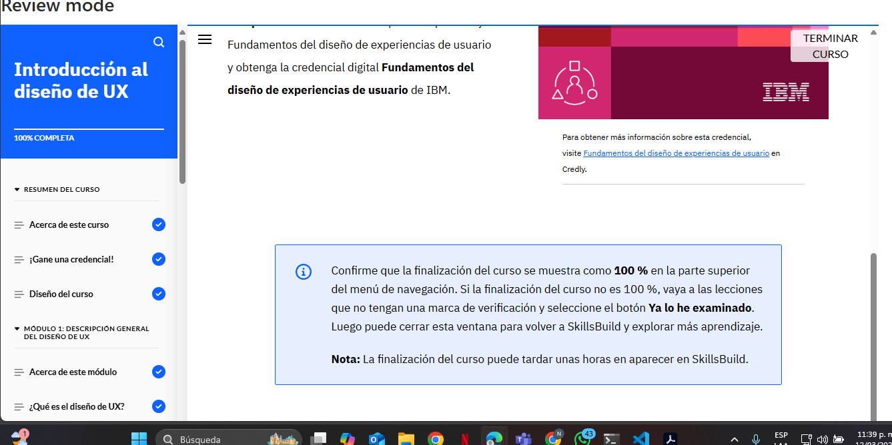

###Puntos Clave del Módulo
El diseño UX se enfoca en crear productos digitales y físicos centrados en el usuario, como sitios web y apps, mejorando su experiencia y accesibilidad.

El diseño UI es una parte del UX que se encarga de crear interfaces visualmente atractivas y fáciles de usar.

Principios esenciales de UX incluyen diseño centrado en el usuario (UCD), accesibilidad, pruebas con usuarios, diseño visual e interactivo, y procesos iterativos.

El UCD pone al usuario en el centro del proceso de diseño, mejorando continuamente el producto a través de iteraciones en análisis, diseño, evaluación e implementación.

Habilidades clave en UX: resolución de problemas, comunicación y pensamiento crítico, además de empatía y creatividad para diseñar productos inclusivos.

Enfoques de diseño web y móvil:

Diseño reactivo: Se ajusta automáticamente a diferentes tamaños de pantalla.
Diseño adaptativo: Crea versiones específicas para cada dispositivo.
Casos prácticos en UX: Demuestran habilidades, experiencia y proceso de diseño, siendo fundamentales para un portafolio profesional.

Evaluación de Conocimientos
Este resumen refleja los conceptos esenciales del módulo. 

