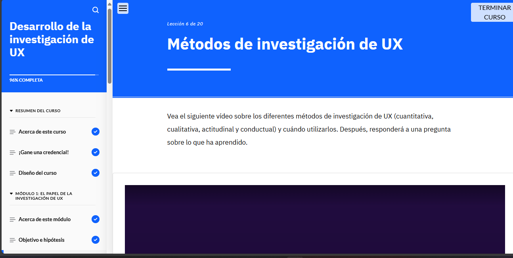

###Puntos Clave del Módulo
El proceso de investigación en UX sigue varios pasos esenciales:

Formular hipótesis claras, medibles y verificables.
Elegir métodos adecuados para recopilar datos relevantes.
Analizar la información recolectada para identificar patrones.
Crear usuarios prototipo basados en la investigación.
Realizar análisis competitivo y comparativo.
El propósito principal de la investigación en UX es comprender las necesidades, comportamientos y dificultades de los usuarios.

Las hipótesis guían la recolección y el análisis de datos y deben ser precisas, medibles y repetibles.

Existen distintos métodos de investigación en UX, como encuestas, entrevistas, pruebas de usabilidad y análisis de datos, combinando enfoques actitudinales, conductuales, cualitativos y cuantitativos.

La síntesis de datos permite estructurar la información para extraer patrones e ideas clave. Para ello, se utilizan herramientas como diagramas de afinidad, análisis temático, visualización de datos y triangulación.

Los usuarios prototipo representan grupos de usuarios y ayudan a tomar decisiones alineadas con sus objetivos, necesidades y comportamientos.

El análisis competitivo evalúa un producto frente a la competencia, mientras que el análisis comparativo lo contrasta con soluciones similares sin necesidad de ser competidores directos. Métodos como FODA, mapas de recorrido y el marco HEART apoyan este análisis.