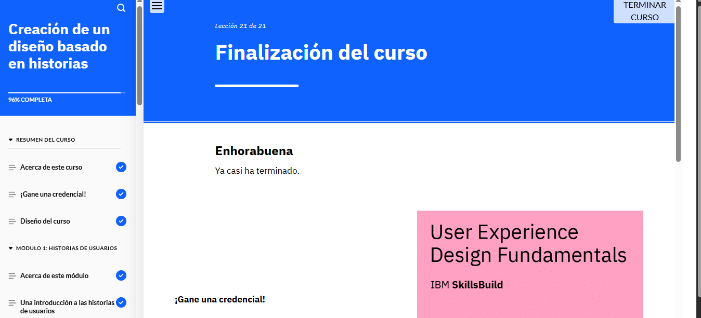

###Puntos Clave del Módulo
Las historias de usuario en UX ayudan a comprender y comunicar las necesidades y expectativas de los usuarios desde su propia perspectiva. Se estructuran en tres partes: rol, acción y ventaja.

Para crear historias de usuario, es necesario:

Basarse en usuarios prototipo.
Identificar sus necesidades y objetivos.
Redactarlas en el formato rol-acción-ventaja.
El recorrido de usuario representa la experiencia completa de un usuario al interactuar con un producto o servicio, pasando por diferentes fases como concienciación, decisión y fidelización.

Los flujos de usuario detallan los pasos específicos que sigue un usuario dentro de un producto digital para alcanzar un objetivo. Los flujos de tareas, dentro de estos flujos, se enfocan en acciones concretas y consideran entradas, información del sistema y posibles errores.

La integración de recorridos y flujos de usuario permite diseñar experiencias más efectivas y alineadas con las necesidades del usuario.

Los bocetos de soluciones son representaciones iniciales de ideas de diseño, elaboradas con herramientas manuales o digitales. Facilitan la colaboración con partes interesadas y aceleran la toma de decisiones en las primeras etapas del diseño.

