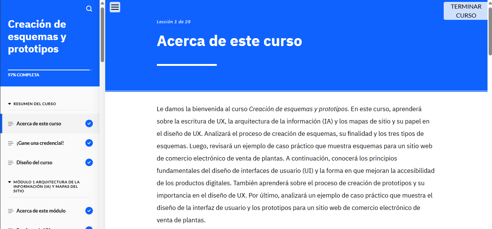

### Puntos Clave del Módulo  

La **escritura de UX** se enfoca en diseñar el contenido textual de las interfaces digitales para mejorar la experiencia del usuario.  

La **arquitectura de información (IA)** organiza y estructura los datos de forma lógica. Para validar su efectividad, se emplea la **técnica de clasificación por tarjetas**.  

Un **mapa de sitio** es un diagrama que representa la jerarquía y estructura de un producto digital.  

Los **esquemas** son representaciones visuales de una interfaz que ayudan a definir su estructura y funcionalidad. Pueden ser de baja, media o alta fidelidad.  

El **diseño de UI** busca crear interfaces visualmente atractivas, accesibles y fáciles de usar, enfocándose en funcionalidad, accesibilidad, interacción y eficiencia.  

Los principios clave en el diseño de UI incluyen:  
- Claridad y simplicidad  
- Control del usuario  
- Gestión de errores  
- Jerarquía visual  
- Teoría del color y tipografía  

La **accesibilidad** garantiza que los productos sean utilizables por todas las personas, incluyendo aquellas con diferentes capacidades.  

Los **prototipos** permiten simular la experiencia de un producto antes de su desarrollo. Se pueden crear en papel o en formato digital, utilizando herramientas según el nivel de fidelidad requerido.