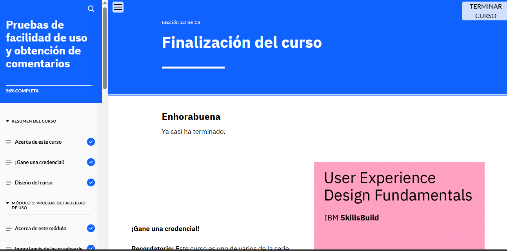

###Puntos Clave del Módulo
Las pruebas de facilidad de uso permiten evaluar la experiencia de usuario observando cómo interactúan los usuarios reales con un producto digital. Su objetivo es identificar problemas, descubrir mejoras y comprender mejor a los usuarios.

Estas pruebas involucran tres elementos clave: moderador, participantes y tareas.

Existen dos enfoques principales:

Pruebas cualitativas, que recopilan opiniones detalladas mediante métodos como pruebas moderadas, no moderadas, de guerrilla o en laboratorio.
Pruebas cuantitativas, que obtienen métricas objetivas a través de pruebas A/B, encuestas, mapas de calor y análisis de usuarios.
El proceso de prueba incluye:

Definir objetivos.
Seleccionar participantes.
Diseñar tareas y escenarios.
Realizar la prueba.
Analizar los datos.
Iterar según sea necesario.
Los problemas detectados se documentan y priorizan según su impacto y costo de solución, utilizando niveles de gravedad del 0 al 4 y la matriz impacto-esfuerzo.

Además, la evaluación heurística es una técnica donde expertos revisan una interfaz basándose en principios de usabilidad.

Para mejorar un prototipo, se analizan los resultados, se implementan soluciones y se actualiza el diseño, iterando hasta lograr una experiencia óptima.