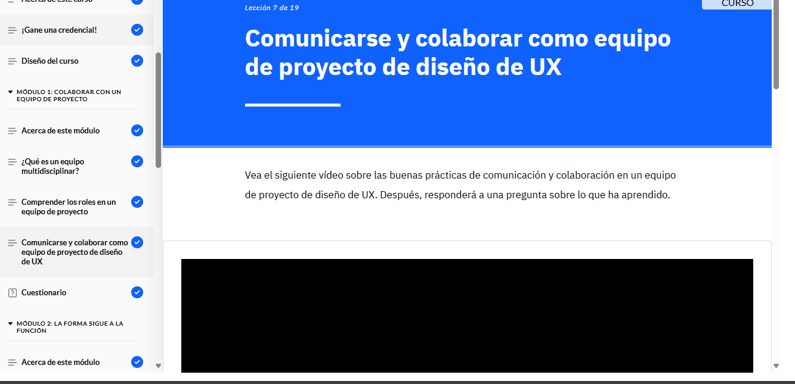

Puntos Clave del Módulo
Un equipo multidisciplinar reúne especialistas de distintas áreas para trabajar en un proyecto común, lo que mejora la eficiencia, fomenta la colaboración y permite detectar problemas con soluciones innovadoras.

Roles clave en un equipo de UX:
Gestor de producto y gestor del proyecto de UX
Diseñador de UX y UI
Investigador de usuarios
Redactor de UX y arquitecto de información
Diseñador visual e interactivo
Evaluador de facilidad de uso
Desarrolladores
Buenas prácticas para la colaboración:
Definir roles y responsabilidades
Programar reuniones periódicas y de revisión
Documentar el proceso y usar herramientas de colaboración
Celebrar los logros del equipo
Entrega de diseño a desarrollo:
Guías de estilo, especificaciones y maquetas
Prototipos y activos visuales
Código del lado del cliente
Ajustes en la fase de desarrollo:
Optimización de recursos y solución de limitaciones técnicas
Pruebas en dispositivos y navegadores
Evaluación de accesibilidad y diseño responsivo
Documentación del proyecto UX:
Incluye la investigación de usuarios, criterios de diseño, prototipos, especificaciones técnicas y estrategia de contenido.

Gestión de versiones y archivos:
Uso de control de versiones
Organización en carpetas y denominación estandarizada
Planes de copia de seguridad
Estas prácticas garantizan un desarrollo eficiente y alineado con las necesidades de los usuarios.
