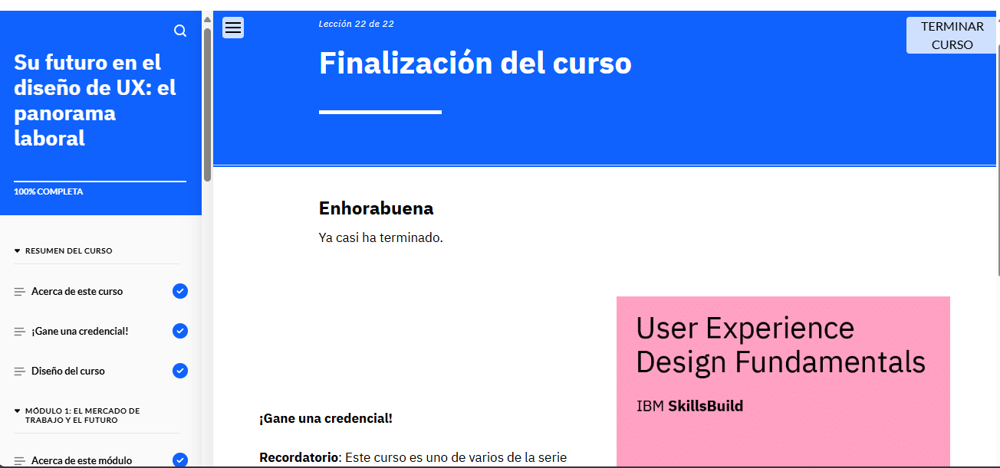

### **Puntos Clave del Módulo**  

#### **Alta demanda de diseñadores UX**  
- Las empresas buscan expertos en UX para mejorar la interacción con los usuarios y optimizar productos digitales.  

#### **Oportunidades y sectores**  
- El campo de UX ofrece múltiples posibilidades de crecimiento y especialización en diversas industrias.  

#### **Roles principales en UX**  
- Diseñador de UX/UI  
- Arquitecto de información  
- Investigador de UX  
- Redactor de UX  
- Diseñador de producto  

#### **Responsabilidades clave**  
- Diseñar soluciones centradas en el usuario  
- Investigar y analizar necesidades de los usuarios  
- Crear perfiles de usuario, esquemas y prototipos  
- Realizar pruebas de usabilidad y mejorar diseños  
- Colaborar con equipos multidisciplinarios  
- Diseñar con accesibilidad e inclusión en mente  

#### **Habilidades esenciales en UX**  
- Diseño técnico y visual  
- Comunicación efectiva  
- Resolución de problemas  
- Pensamiento analítico y empatía  

#### **Herramientas de UX**  
- Software de diseño y prototipado  
- Herramientas de pruebas de usabilidad y accesibilidad  
- Plataformas de colaboración y comunicación  

#### **Conocimiento de programación**  
- Lenguajes como JavaScript, JSX, HTML5 y CSS/SASS mejoran la integración con desarrollo.  

#### **Claves para el éxito en UX**  
- Empatía, curiosidad y pensamiento crítico  
- Adaptabilidad y actitud positiva  
- Mentalidad centrada en el usuario  

#### **Primeros pasos en UX**  
- Crear un portafolio  
- Construir una red profesional  
- Aprender herramientas clave  
- Buscar retroalimentación y mejorar continuamente  
- Explorar oportunidades como pasantías o voluntariados  

El diseño de UX es un campo dinámico con un gran potencial de crecimiento y oportunidades laborales.