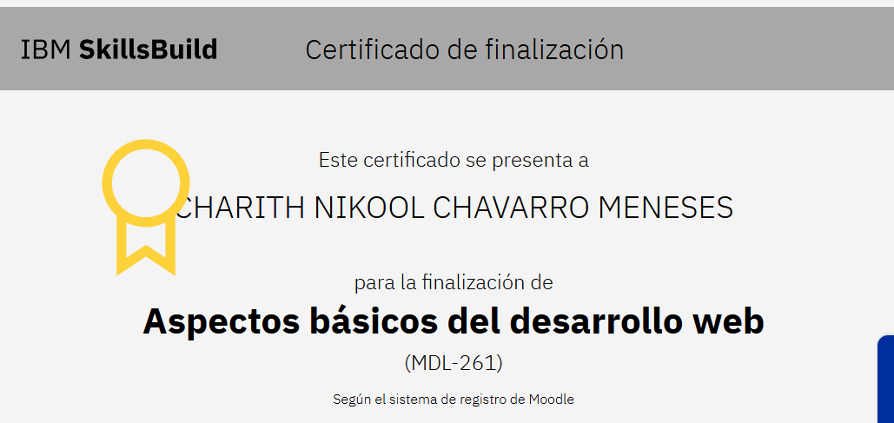
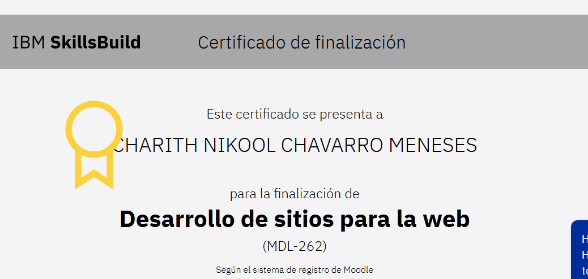
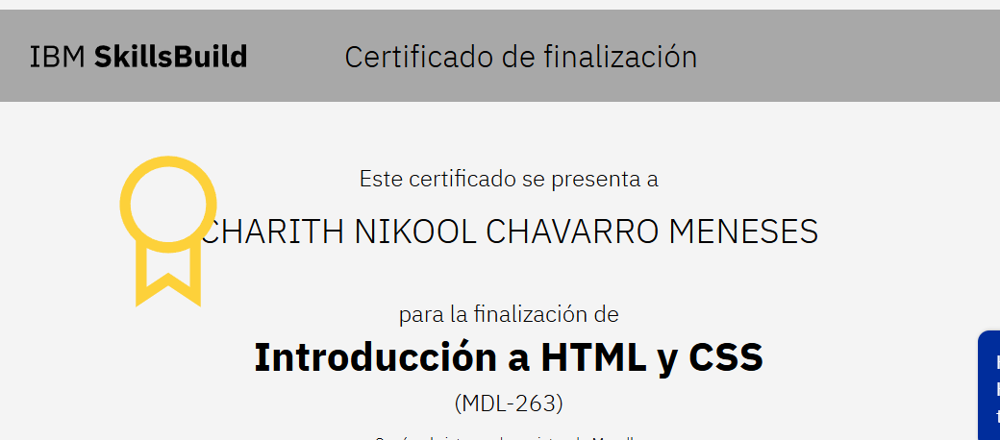
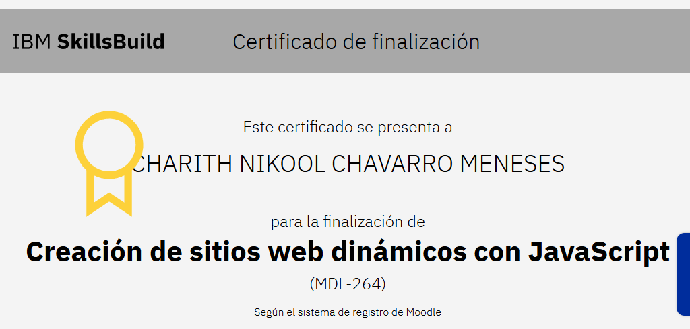
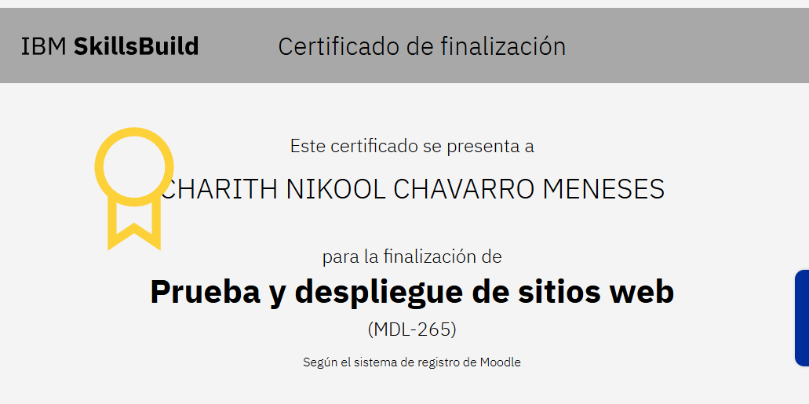
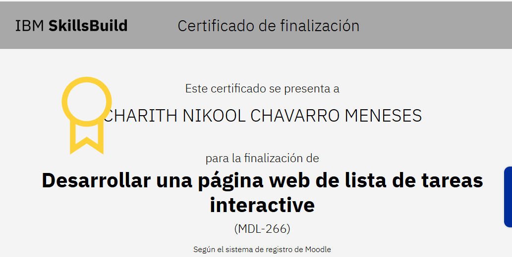
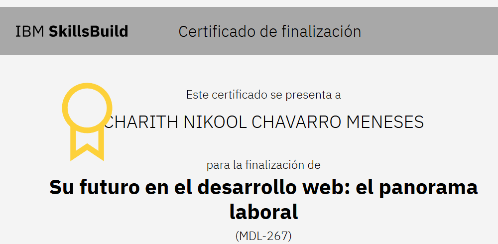

## Módulo 1: Fundamentos del Desarrollo Web
En este primer módulo se exploraron los conceptos esenciales del desarrollo web, incluyendo cómo funciona internet, el modelo cliente-servidor, y el papel que juegan los navegadores y los servidores. También se revisaron las herramientas básicas que utilizan los desarrolladores y cómo interactúan distintas tecnologías para construir sitios web.

### certificado

## Módulo 2: Diseño y Estructura de Sitios Web
Este módulo se enfocó en la creación de sitios web bien organizados y funcionales. Se estudiaron buenas prácticas de diseño, navegación intuitiva y cómo ofrecer una experiencia centrada en el usuario. Además, se aplicaron principios de accesibilidad y usabilidad para mejorar la experiencia general del sitio.

### certificado

## Módulo 3: Introducción a HTML y CSS
Se introdujeron los lenguajes esenciales del desarrollo web: HTML y CSS. Aprendimos a estructurar páginas con etiquetas semánticas y a aplicar estilos visuales para controlar la presentación del contenido. También se practicó la distribución de elementos y el diseño visual general del sitio.

### certificado

## Módulo 4: Interactividad con JavaScript
Aquí se incorporó JavaScript para hacer las páginas más dinámicas e interactivas. Se trabajó con la manipulación del DOM, eventos del usuario y lógica de programación básica usando variables, funciones y estructuras de control.

### certificado

## Módulo 5: Pruebas y Publicación de Sitios Web
Este módulo se centró en la verificación del funcionamiento de un sitio web. Se realizaron pruebas prácticas, se identificaron errores comunes, y se aprendió cómo desplegar un proyecto en línea para hacerlo accesible públicamente.

### certificado

## Módulo 6: Proyecto Práctico - Lista de Tareas
Como ejercicio integrador, se desarrolló una aplicación web de lista de tareas utilizando HTML, CSS y JavaScript. La app permite agregar, editar, eliminar tareas y almacenar datos localmente, aplicando todo lo aprendido en los módulos anteriores.

### certificado

## Módulo 7: El Futuro Profesional en el Desarrollo Web
Finalmente, se exploró el panorama laboral del desarrollo web. Se discutieron las habilidades más valoradas en el mercado, las distintas áreas de especialización, y cómo construir un portafolio que destaque. También se compartieron consejos útiles para mejorar la empleabilidad y sobresalir en procesos de selección.

### certificado

